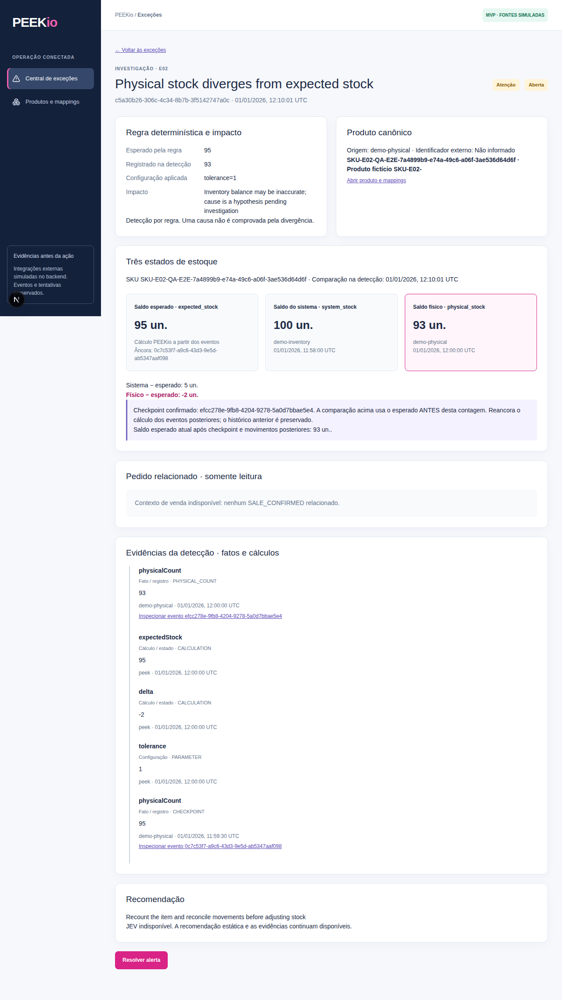
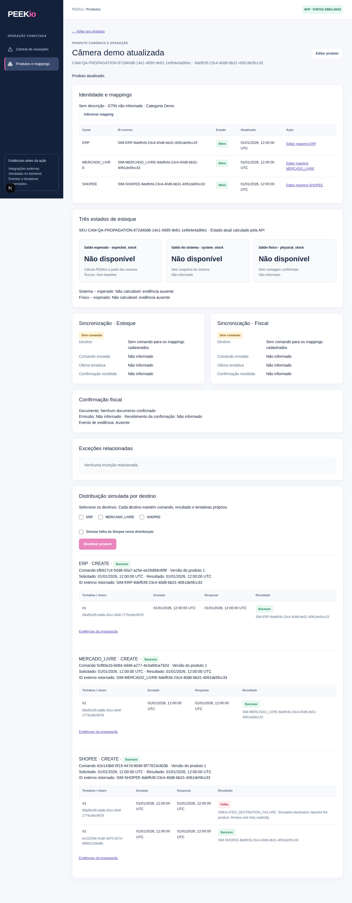
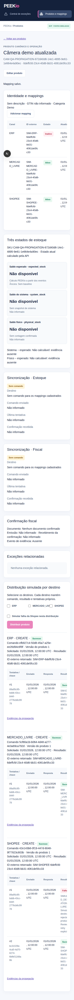

# Frontend and integration verification

## Reproduction order

Prerequisites: Java 21, Maven 3.9+, Node.js 22.18+, PostgreSQL 16+ and Chromium.
Use fictitious local databases only. This branch is based on main cfbdc35 (local MCP E01 recovery); its V4 is preserved and product propagation uses V5. If you tested an earlier prototype V4 propagation migration, create a fresh isolated database rather than editing applied Flyway history. From the repository root:

```sh
docker compose up -d postgres
docker compose exec postgres createdb -U peek peek_test
cd backend
mvn clean verify
mvn package
java -jar target/backend-0.1.0-SNAPSHOT.jar --spring.profiles.active=demo --peek.demo.clock=2026-01-01T12:00:00Z
```

The test database creation is a one-time step. `PEEK_TEST_DB_*` configure the
isolated test database; `PEEK_DB_*` configure the demo runtime. The fixed clock
is available only with the `demo` profile. Evaluations use an explicit `asOf`;
no real timeout waiting is required. Reset is also enabled only for demo.

In a second terminal:

```sh
cd frontend
npm ci
npm run format:check
npm run lint
npm test
npm run test:fixtures
npm run build
npx playwright install --with-deps chromium
npm run test:e2e
```

Playwright creates three products in a unique `QA-*` namespace, sends distinct
source payloads through the sales/inventory/physical/fiscal adapters, creates
commands, sends/omits confirmations and evaluates at 12:10:01 UTC. It verifies
both valid and violated conditions. E01/E02 and E03/E04 are replayed twice,
with two resets between executions. Only the test-owned products and their
linked state are deleted. The second reset must return `totalDeleted=0`.

## Recorded result — 2026-09-30 UTC

| Gate | Executed result |
| --- | --- |
| Backend Java 21 / Maven 3.9.11 / PostgreSQL 16 | `mvn clean verify`: 22 unit + 34 integration tests passed, no failures or skips |
| Frontend Node 24.19.0 | `npm ci`, Prettier check, strict TypeScript check and Next.js build passed |
| Vitest | 13 tests passed: typed HTTP, filters/errors, E01/E02, missing stock/order/mapping, resolution, retry, optional JEV rendering/fallback, product/mapping validation |
| Fixture API | 1 test passed: independent startup, status/code filters, missing mapping, mutations rejected |
| Playwright / Chromium | 3 end-to-end tests passed with the real Spring Boot/PostgreSQL API |
| Visual inspection | Desktop E02 investigation and product distribution; mobile product detail at 390 × 844; no body overflow |

The first browser run exposed an exact label selector mismatch in the test;
it was changed to the combobox accessible name. A client test initially reused
a consumed Response object; its fixture now returns a fresh response. Both
were corrected and the suites were rerun successfully. During integration of
the new main, an obsolete V4 propagation resource was removed; the final clean
build applies V4 MCP plus V5 propagation on fresh isolated databases.

### Acceptance mapping

| Issue | Evidence supporting closure after merge |
| --- | --- |
| #13 | Typed API client, server proxy, routing/shell, explicit read-only fixtures, lint/build |
| #38 | API product create/edit/list/detail, mappings and version headers, explicit missing/pending/inactive states and conflicts |
| #41 | Product context API, expected/system/physical stock, stock/fiscal command versus confirmation timestamps, attempts and related exceptions |
| #42 | V5 migration, simulated output adapter, per-destination commands, stable external effect/ID, partial failure, append-only retry; backend and browser tests |
| #9 | API status/code filters and preserved ordering, open/resolved/empty/error tests |
| #8 | Integrated investigation, evidence timeline, configuration, impact, three stocks, checkpoint, static fallback |
| #7 | Explicit eligible retry and confirmation, preserved attempts, resolve with note, API failure handling and refresh |
| #10 | Read-only context from SALE_CONFIRMED, source/time/quantity/reference; absent context test |
| #11 | Expected/system/physical separately labelled, differences and missing values; E02 pre-count comparison and future checkpoint anchor |
| #12 | Canonical product resolution using origin/external ID, explicit missing/inactive mapping, no investigation CRUD |
| #5 | E03/E04 normal and violated fixtures, evidence/timeout/tolerance/action and two reset/replays through actual API/UI |
| #6 | E01/E02 duplicate/replay, controlled time, investigation, static JEV fallback, retry, resolution, reset/replay through actual API/UI |

These are closure recommendations for the frontend/integration scope of this
branch. No issues are closed by this document. The external LLM provider and
intelligence enrichment are separate backend work; this delivery uses the
required deterministic fallback. No live ERP, marketplace or fiscal service
is required. Postman was not executed; validation used Maven and Playwright.

## Screenshots




