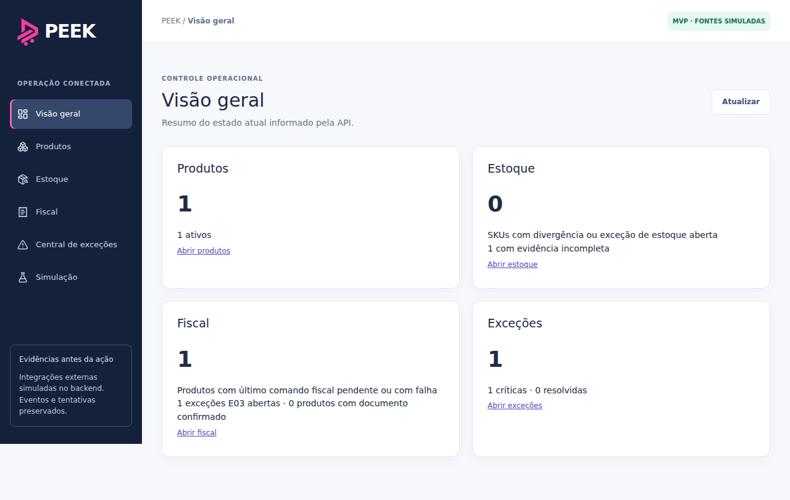
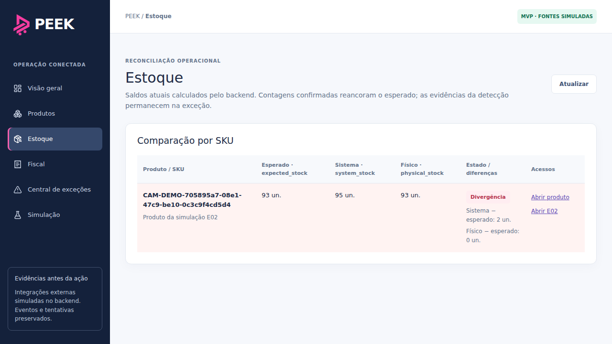
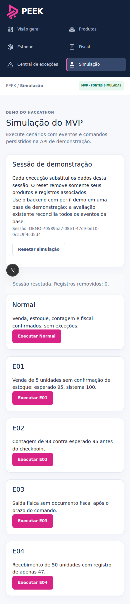

# Validação — issues #53, #54 e #56

Base de publicação: `joaa0/PEEK`, main
`1669d82759eb8a4750d419ccf1768abfd54fd5dc`, árvore oficial
`732a653e69fb4560942673970357fc764fe71917`. Todos os blobs dessa base foram
verificados antes da integração. A entrega original partiu de `51be806`;
as mudanças concorrentes de JEV, correção limitada de estoque e shell/Fiscal
foram preservadas e a suíte completa foi executada sobre a base atualizada.

Publicação autorizada em 30/09/2026 na branch
`codex/overview-inventory-simulation`, PR #58 em rascunho. O merge permanece
aguardando autorização; as issues continuam abertas. Estas três telas não
alteram regras de domínio, migrações ou contratos do backend.

## Entrega e critérios de aceite

| Issue | Implementação | Validação |
| --- | --- | --- |
| #53 | `/overview`: cards de Produtos, Estoque, Fiscal e Exceções com agregações dos contextos e alertas da API; estados de carregamento, vazio e erro com nova tentativa | Testes de interface, links para produtos/estoque/fiscal/exceções, navegação no navegador |
| #54 | `/inventory`: SKU, expected_stock, system_stock, physical_stock, diferenças, ausência de evidência, destaque de divergência e acessos ao produto/exceções E01/E02/E04 abertas | Testes de saldo zero versus ausência, E02 aberta após reancoragem, consulta ao PostgreSQL via API e navegação |
| #56 | `/simulation`: Normal, E01, E02, E03 e E04 com eventos dos adapters, comandos, confirmações, avaliação e reset existentes; resultado só após verificar o contexto persistido | Cada cenário executado duas vezes na mesma sessão; abertura de produto e exceção; reset repetido com segunda remoção igual a zero |

O card Fiscal aponta para a tela existente `/fiscal`, preservada da main.
Os números fiscais distinguem produtos com comando pendente/falha, produtos com
documento confirmado e quantidade de exceções E03 abertas.

A comparação de estoque mostra o estado **atual**. Uma contagem confirmada
reancora o esperado; uma E02 aberta continua visível e leva à evidência do
esperado **antes** da contagem. Ausência não vira saldo zero nem estado normal.

## Cenários persistidos

| Cenário | Fatos emitidos | Resultado |
| --- | --- | --- |
| Normal | Baseline 100, venda 5, estoque 95, contagem 95, saída e documento correlacionados | Comandos de estoque e fiscal CONFIRMED; nenhuma exceção nesta sessão |
| E01 | Baseline 100, venda 5, comando de estoque sem confirmação | E01; esperado 95 e sistema 100 |
| E02 | Venda 5, confirmação de estoque 95, contagem 93 | E02 com esperado 95 na detecção e físico 93; esperado atual reancorado em 93 |
| E03 | Venda e estoque confirmados; saída física e comando fiscal sem documento | E03 após a janela do comando |
| E04 | Baseline 100, recebimento 50, registro 47 | E04; esperado atual 150 e sistema 147 |

O relógio vem de `Product.createdAt` do backend. A avaliação avança explicitamente
além dos prazos reais dos comandos, sem espera de minutos. O simulador não
aceita checkpoints E02 nem resolve exceções.

O identificador `DEMO-*` permanece no sessionStorage da aba. Cada execução
substitui somente esse namespace; o reset remove produtos e registros associados,
inclusive execuções parciais. A avaliação existente é global, portanto a demo
usa uma base isolada. O perfil demo é necessário; fixtures permanecem somente
leitura. Erros não são apresentados como execução bem-sucedida.

## Verificação executada

Revalidação para publicação concluída em 30/09/2026, após a autorização de
subida ao GitHub, usando bases novas e isoladas; **184 testes distintos aprovados**, sem falhas ou skips nas execuções finais.

| Etapa | Resultado final |
| --- | --- |
| Java 21.0.12 / Maven 3.9.11 / PostgreSQL 16.15 | `mvn clean verify`: 57 testes unitários + 84 de integração aprovados |
| Node 24.19.0 / Next.js 16.3.7 | `npm ci`, Prettier, TypeScript e build aprovados |
| Vitest | 35 testes aprovados, incluindo 9 testes das novas telas e os contratos HTTP de simulação |
| API de fixtures | 1 teste aprovado; mutações continuam rejeitadas |
| Playwright / Chromium | 7 testes aprovados: 4 contra Spring Boot/PostgreSQL reais e 3 de shell/Fiscal com fixtures HTTP explícitas |
| Replays da nova tela | Normal, E01, E02, E03 e E04 executados duas vezes; produtos e exceções consultados na API |
| Reset | Segunda execução de reset remove 0 registros; navegação mantém o mesmo namespace |
| Inspeção visual | Visão geral e Estoque no desktop; Simulação a 390 × 844, sem overflow horizontal |

A primeira execução do novo teste de navegador encontrou um seletor ambíguo:
95 unidades apareciam tanto no esperado quanto no sistema, corretamente. O
seletor foi restringido à perspectiva correspondente e a suíte completa passou.
Na revalidação da base atualizada, dois arquivos foram formatados e um JAR
vazio produzido no ambiente foi reconstruído com `mvn clean package -DskipTests`.
A integridade ZIP e o manifesto do pacote foram verificados antes da suíte
completa de navegador, aprovada. Os 141 testes do backend já haviam passado
no `mvn clean verify`; nenhuma alteração de backend foi necessária.

As primeiras tentativas de infraestrutura exigiram configuração do proxy,
carregamento explícito do Mockito e execução dos serviços no mesmo namespace
de rede; a validação final acima foi executada integralmente.

Essas três issues estão implementadas e validadas para revisão e posterior
integração. A publicação do commit e da branch foi autorizada em 30/09/2026;
o merge permanece aguardando autorização. As issues continuam abertas.

## Reprodução

Siga a ordem de `frontend_validation.md`: Java 21, Maven 3.9+, PostgreSQL 16+
e Node 22.18+. Use bases locais distintas `peek_test` e `peek`.

```sh
cd backend
mvn clean verify
java -jar target/backend-0.1.0-SNAPSHOT.jar --spring.profiles.active=demo --peek.demo.clock=2026-01-01T12:00:00Z
```

Em outro terminal:

```sh
cd frontend
npm ci
npm run format:check
npm run lint
npm test
npm run test:fixtures
npm run build
npx playwright install --with-deps chromium
npm run test:e2e
```

No ambiente usado nesta validação, Mockito foi carregado com `-DargLine=-javaagent:<caminho-do-mockito-core-5.17.0.jar>` porque a JVM não permite auto-attach.
PostgreSQL 16 foi executado em namespace local isolado, com uma adaptação de
identidade do processo apenas para a infraestrutura de testes. Essas adaptações
ficam fora do repositório; a aplicação e o banco executaram os contratos reais.

## Evidências visuais






